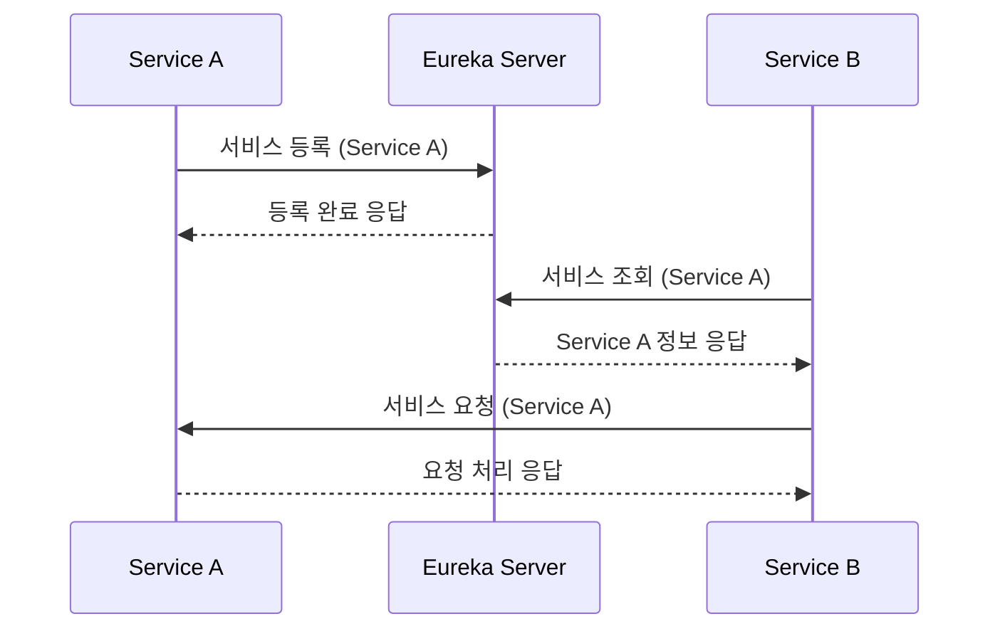

# DPANG EUREKA SERVER

## 🌐 프로젝트 개요

이 프로젝트는 서비스 디스커버리를 담당하는 마이크로서비스로서, 다른 마이크로서비스들이 서로를 찾고 통신할 수 있는 환경을 제공합니다.

## 🔀 프로젝트 아키텍처



이 시퀀스 다이어그램을 통해 볼 수 있듯이, 각 마이크로서비스는 먼저 Eureka Server에 본인의 정보를 등록합니다. 

이후 다른 마이크로서비스가 필요로 하는 경우, Eureka Server를 통해 해당 서비스의 정보를 조회하고 직접 통신을 수행합니다.

이렇게 함으로써, 각 마이크로서비스는 별도의 네트워크 위치 정보 없이도 서로를 찾아 통신할 수 있게 되어, 서비스의 확장성과 장애에 대한 견고성이 향상됩니다.

## ✅ 프로젝트 실행

해당 프로젝트를 추가로 개발 혹은 실행시켜보고 싶으신 경우 아래의 절차에 따라 진행해주세요

#### 1. 프로젝트 실행

```commandline
./gradlew bootrun
```

**참고) 프로젝트가 실행 중인 환경에서 아래 URL을 통해 Eureka Dashboard를 확인할 수 있습니다.**

```commandline
http://localhost:8761
```